# Active Directory Home Lab – Windows Server 2025 (VirtualBox)

**Built by:** Patrick E
**Date:** April 2026  
**Domain:** `LAB.local`  
**Platform:** Oracle VirtualBox

## Project Overview
Built a functional multi-VM Active Directory domain environment in Oracle VirtualBox. This lab simulates a small corporate network with a Domain Controller and a client machine, providing hands-on practice for CompTIA A+ / Network+ and entry-level IT admin roles.

## Lab Topology

**Legend:**
- Blue = Server / Domain Controller  
- Green = Client  
- Orange = VirtualBox components  
- Cloud = Internet (via NAT adapter on host)

**Network Details:**
- Isolated lab network using Host-Only Adapter (`192.168.10.0/24`)
- Domain Controller (DC01): Windows Server 2025 Standard Desktop Experience
- Client PC: Windows 11 Pro
- No direct internet on internal adapter (NAT used only when needed)

## Skills Practiced
- VirtualBox VM creation and networking setup (NAT + Host-Only Adapter)
- Windows Server 2025 Desktop Experience installation
- Active Directory Domain Services installation and domain promotion
- DNS, Organizational Units (OU), user/group, and Group Policy configuration
- Windows 11 client domain join
- File sharing and network drive mapping
- Troubleshooting domain join and basic AD issues

## 1. Server Installation & Preparation

**Selected Windows Server 2025 Standard Evaluation with Desktop Experience**  
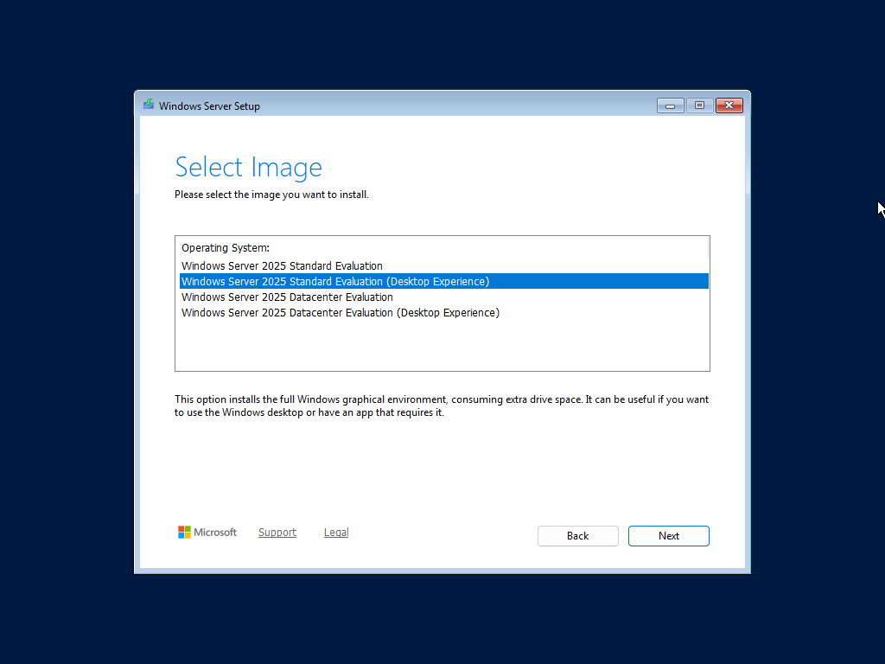

**Installed Oracle VirtualBox Guest Additions**  
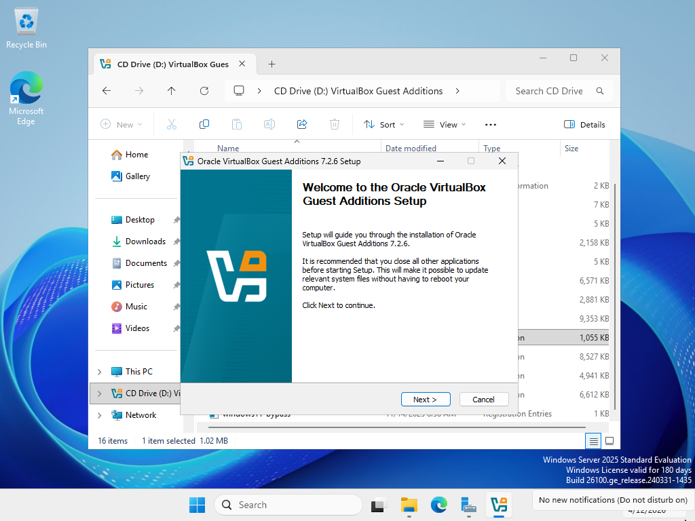  
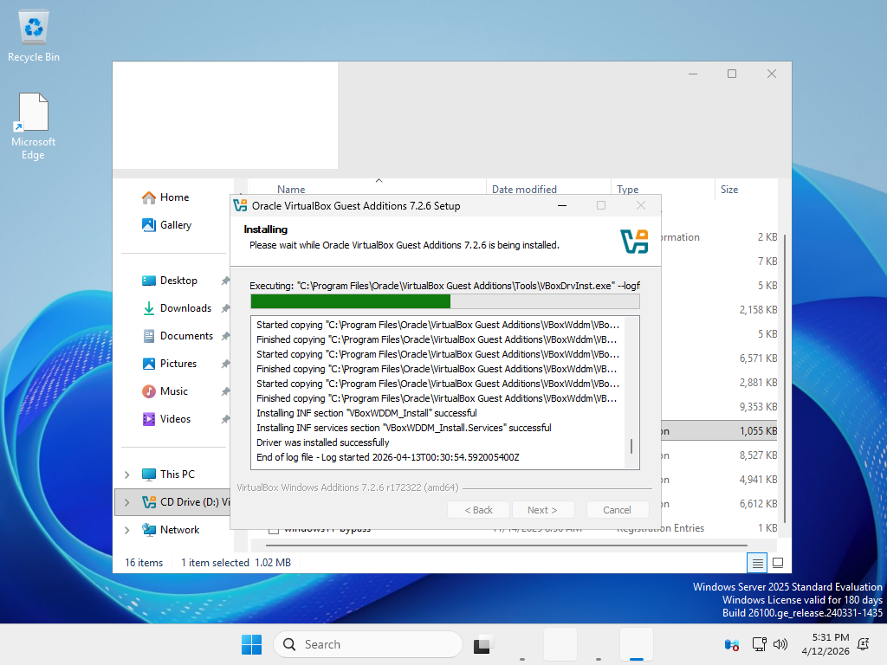

## 2. Domain Controller Promotion

**Promoted server to Domain Controller**  
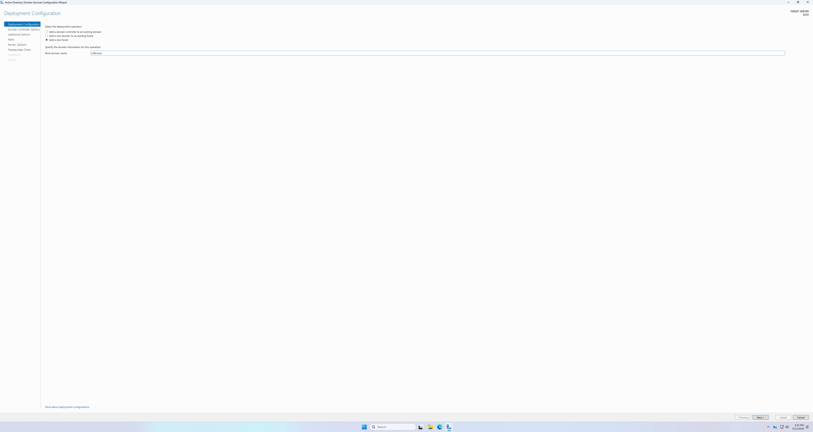

**Active Directory Domain Services role installation completed successfully**  
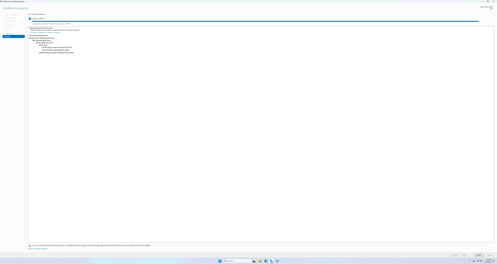

## 3. Active Directory Users and Groups

**Active Directory Users and Computers – Domain users created**  
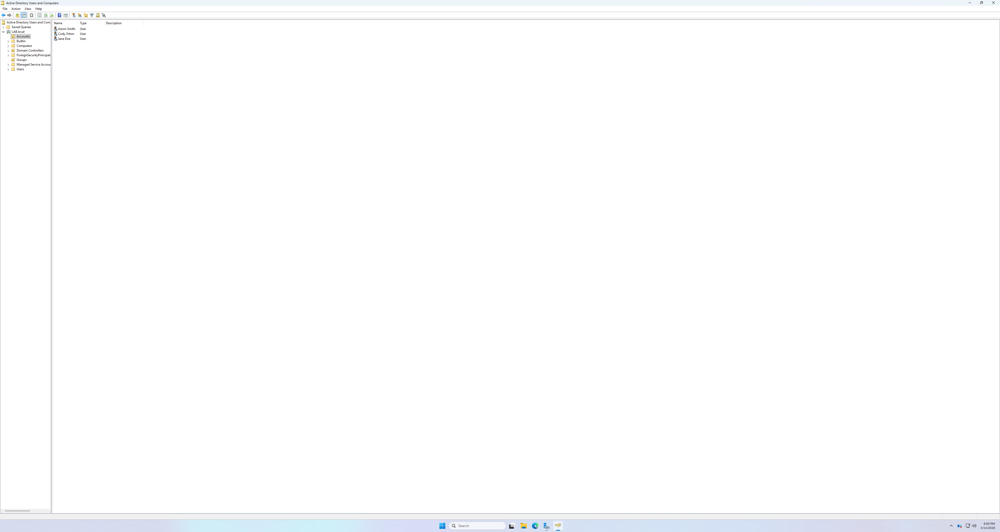

**Security Groups created (Help Desk, Sales, HR)**  
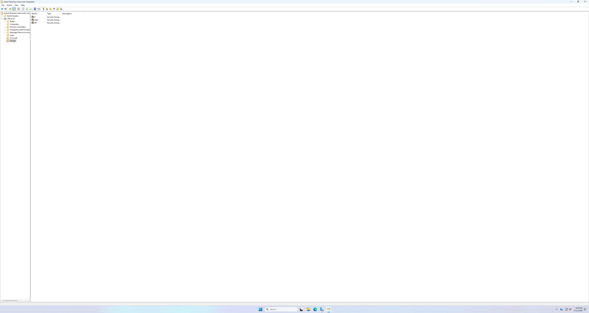

**HR group with member added (Cody Orton)**  
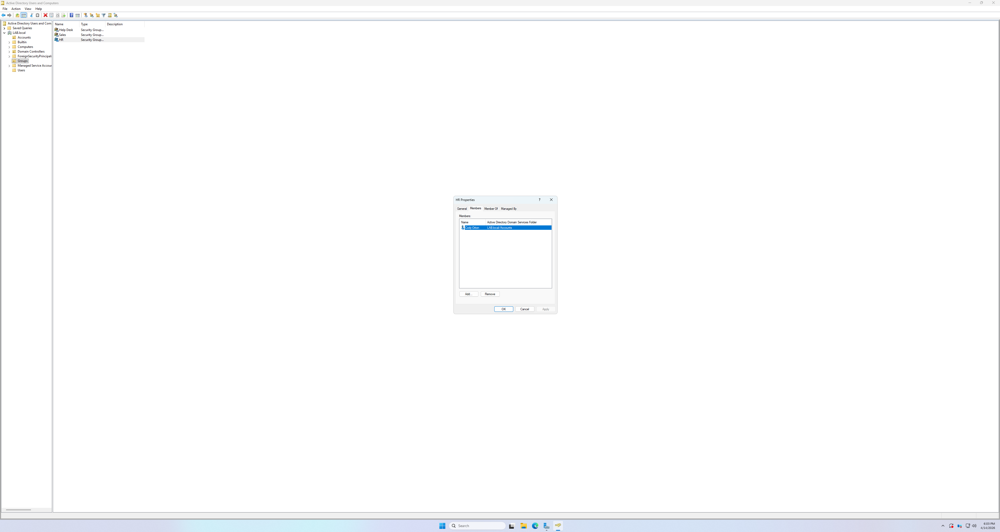

**User properties configuration**  
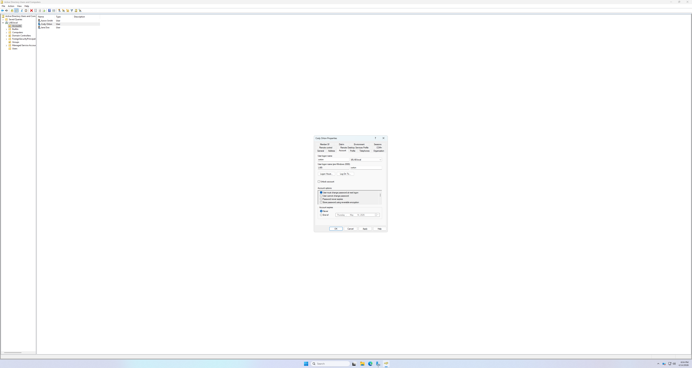

## 4. File Sharing Configuration

**Created HR departmental file share**  
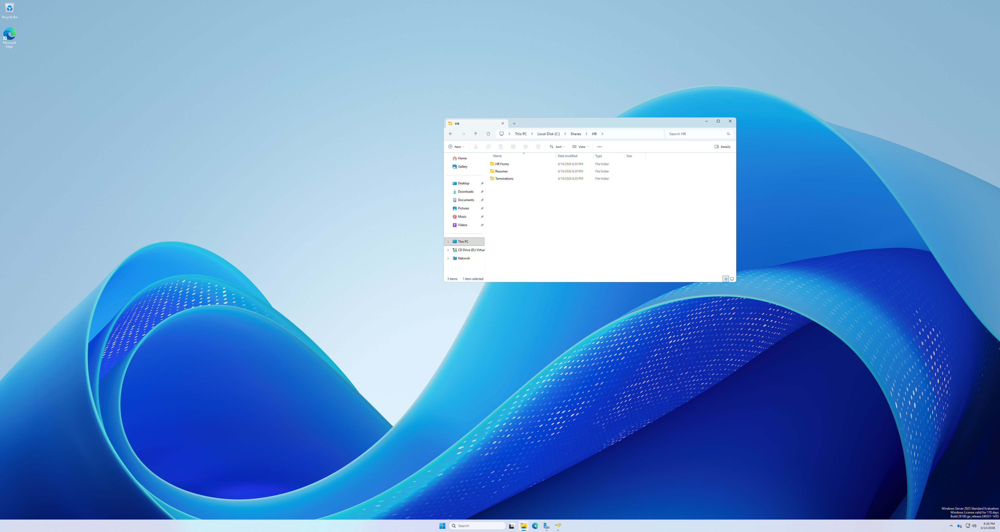

**Client VM successfully mapped \\LAB.local\HR as drive H:**  
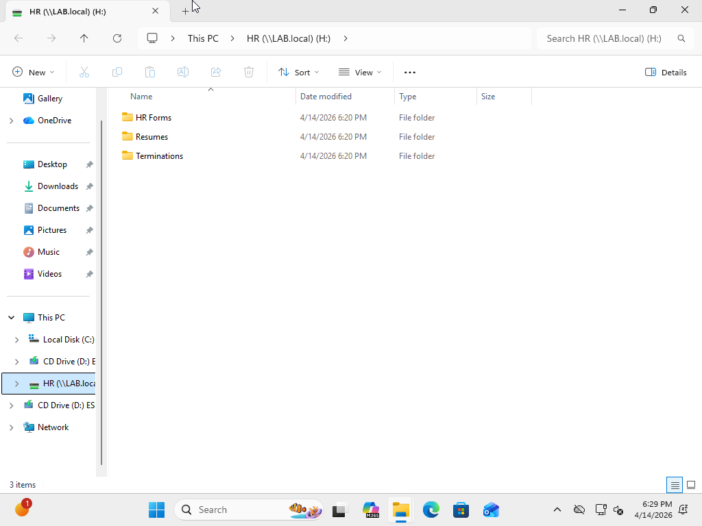

## 5. Verification and Management

**PowerShell verification of domain configuration**  
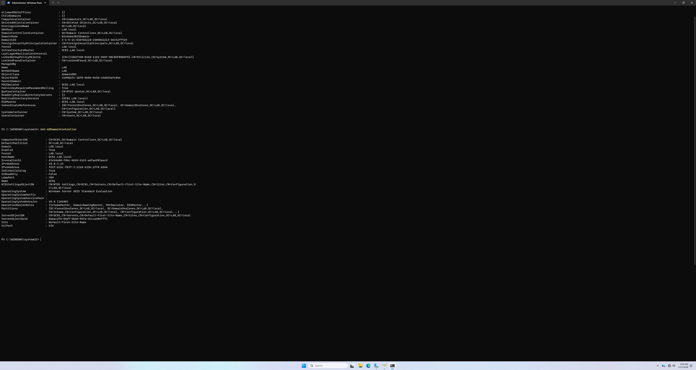

**Password reset for domain user**  
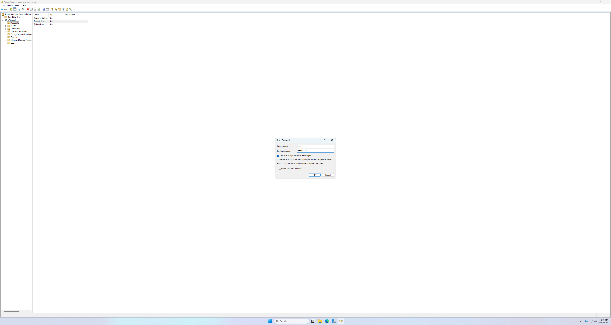

## Key Takeaways & Lessons Learned

- Successfully built and promoted a Windows Server 2025 Domain Controller, establishing a new Active Directory forest and domain (`LAB.local`).
- Learned the importance of using **security groups** for efficient permission management instead of assigning rights directly to users.
- Configured realistic departmental file shares and demonstrated seamless access from a domain-joined client using mapped network drives.
- Gained practical experience with core AD tools: Active Directory Users and Computers (ADUC), domain promotion wizard, and PowerShell for verification.
- Understood the complete end-to-end workflow from OS installation through domain join and resource sharing.
- Recognized that careful network configuration in VirtualBox (Host-Only vs NAT) is critical for isolated lab environments.

This lab provided strong foundational knowledge of Active Directory administration and prepared me for more advanced topics such as Group Policy Objects (GPOs), Organizational Units (OUs), and troubleshooting real-world domain issues.

## Technologies Used
- Oracle VirtualBox
- Windows Server 2025 Standard Evaluation (Desktop Experience)
- Windows 11 Pro (Client)
- Active Directory Domain Services
- PowerShell

---

**Note:** This was a fully isolated lab environment. The client and server communicated over a Host-Only network,
