# DHCP Lab - Azure Implementation (Jake's Tech Labs)

**Date:** April 2026  
**Student:**  Myself

## Lab Objective
Configure a Windows Server 2025 DHCP server in Microsoft Azure with multiple scopes, exclusions, scope options, and a reservation.

## 1. Azure Environment Setup

Created resource group, virtual network, and Windows Server VM (`dc1`).

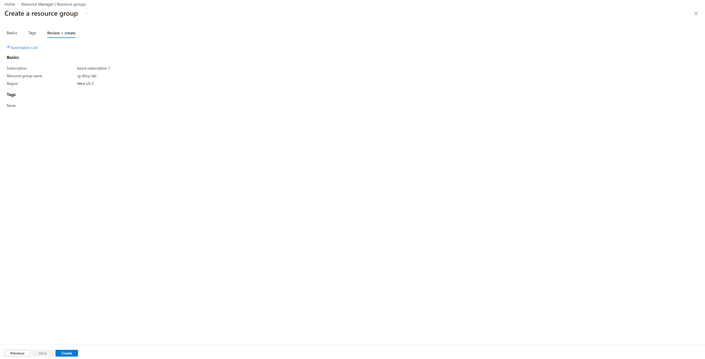

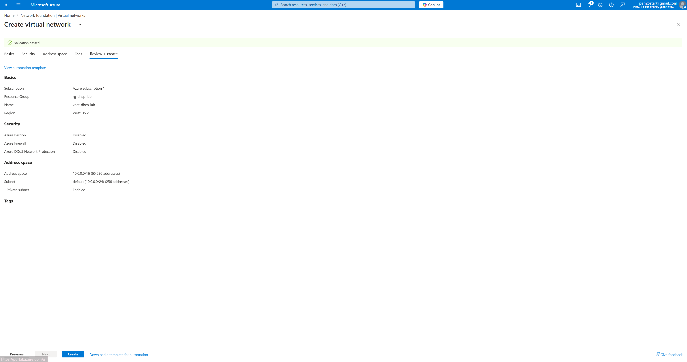

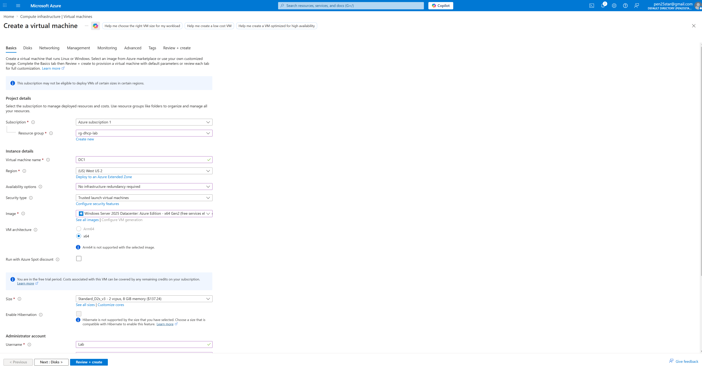

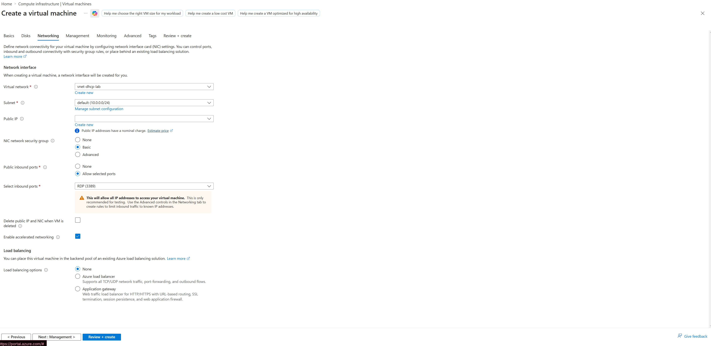

Downloaded RDP file and connected to the VM.

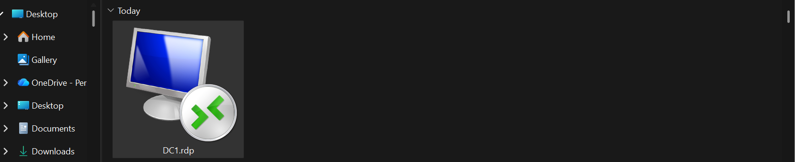

Verified internal IP address inside the VM.

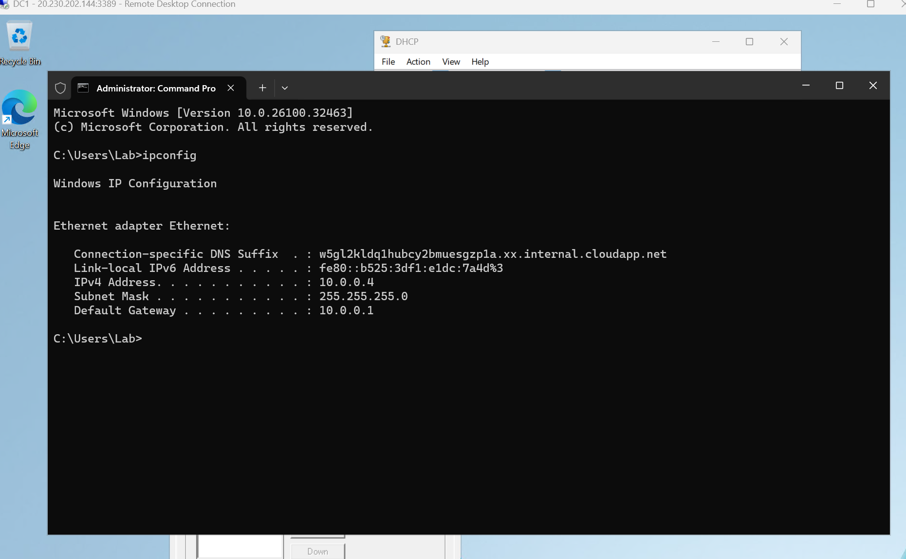

## 2. DHCP Server Role Installation

Installed DHCP Server role via Server Manager.

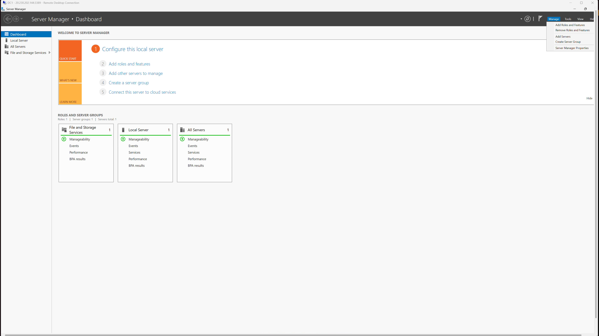

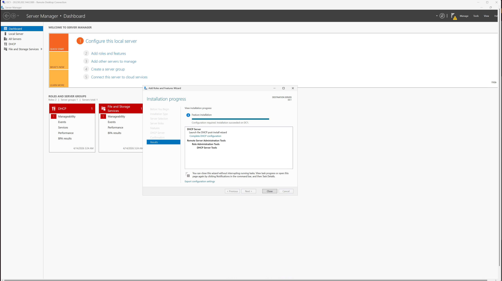

## 3. DHCP Scopes

Created and activated three scopes:
- **Users LAN** – 192.168.1.0/24
- **Corporate Voice** – 192.168.2.0/24
- **Guest Wi-Fi** – 192.168.3.0/24

All scopes confirmed **Active**.

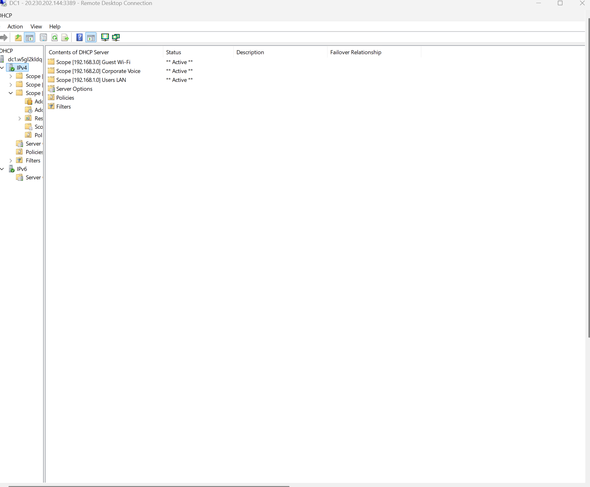

## 4. Scope Options

Configured the following options on each scope:
- **003 Router**: 192.168.x.254 (per scope)
- **006 DNS Servers**: 10.0.0.4 (dc1 private IP)
- **015 DNS Domain Name**: lab.local

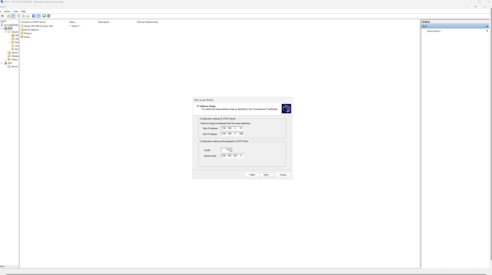

## 5. Address Exclusions

Added exclusion ranges inside each scope to protect static/infrastructure IPs.

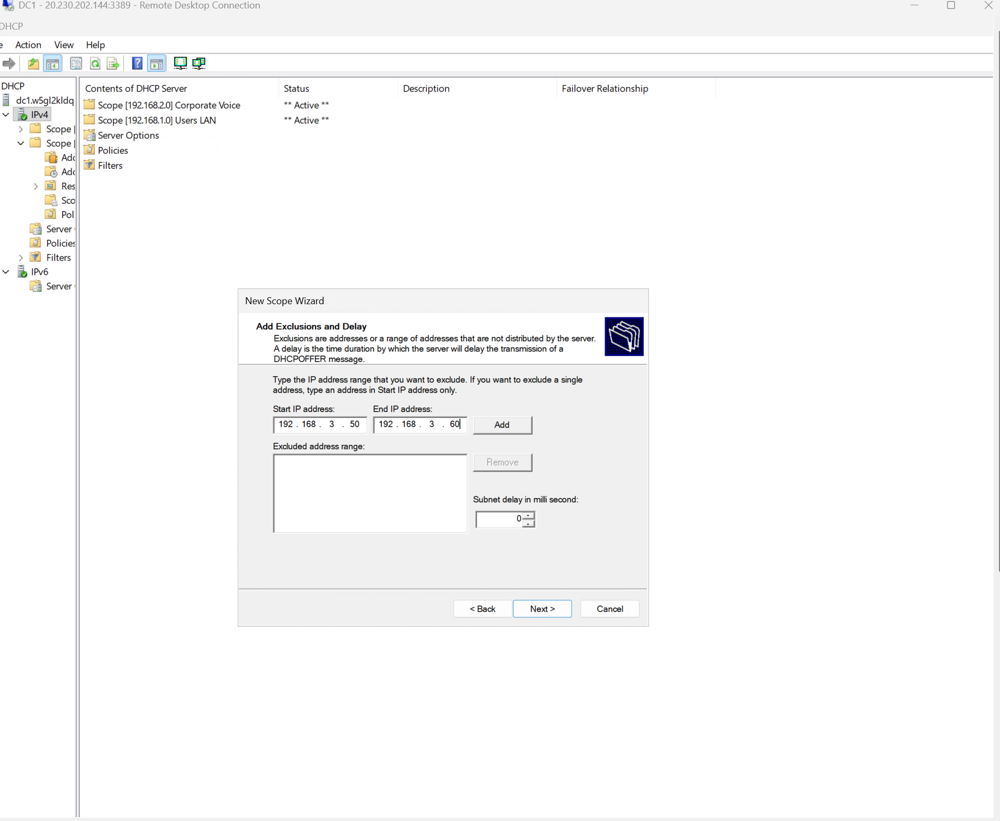

## 6. DHCP Reservations

Created a reservation for **Printer-01** (IP: 192.168.1.25).

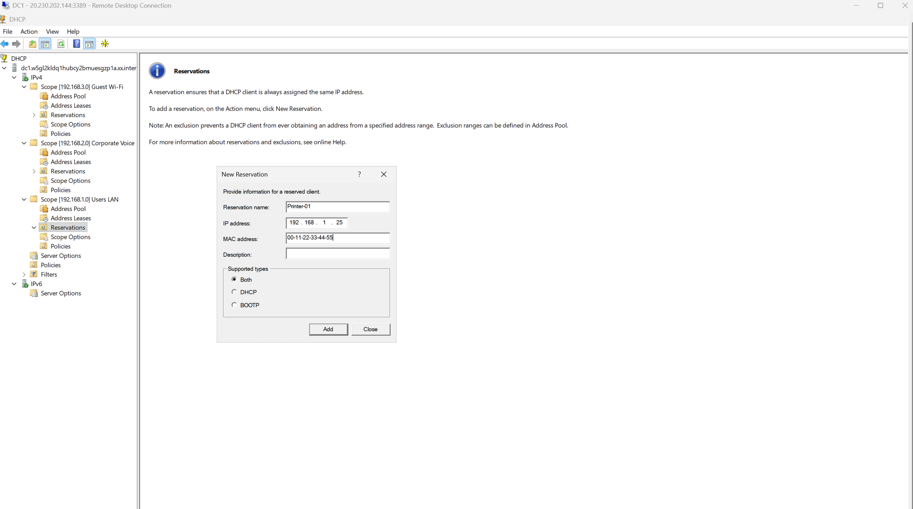

## 7. Final Validation

- Scopes are Active (verified via GUI and PowerShell)
- DHCP Server service is Running
- Right-click menu confirms activation status

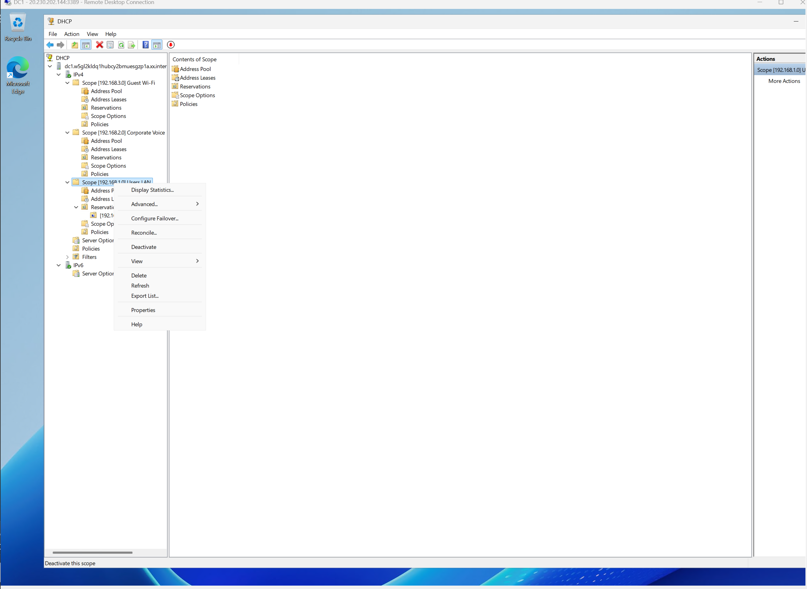

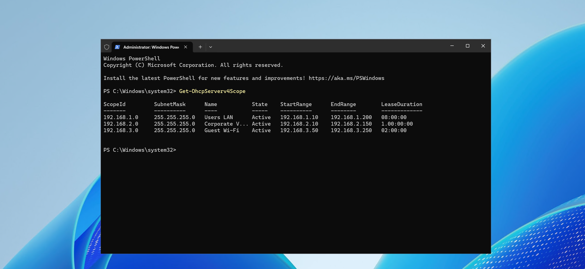

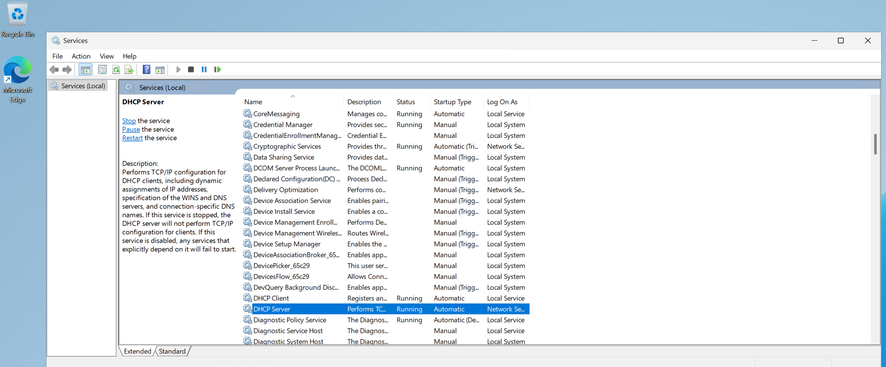

## Azure-Specific Notes
This lab was performed entirely in Azure. Real client DHCP leasing is handled by Azure’s platform DHCP, so validation focused on **server-side configuration** only.

## Key Takeaways
- Successfully built a multi-scope DHCP server with proper options and reservations.
- Understood the difference between exclusions (for infrastructure) and reservations (centralized static IPs).
- Gained hands-on experience with Windows Server DHCP MMC and PowerShell validation.
- Learned Azure networking constraints when running DHCP labs.

## Cleanup
Stopped and deallocated the VM, then deleted the resource group `rg-dhcp-lab` to prevent unnecessary costs.

---
