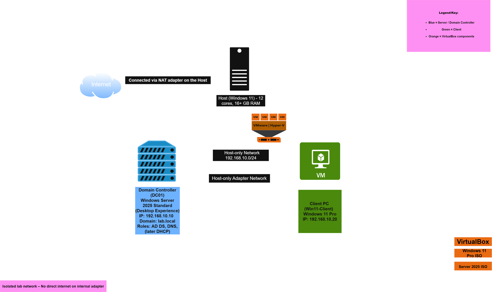

# IT Labs Portfolio

Documentation for my home lab projects focused on **CompTIA A+ Core 2, Network+, Security+**, and practical IT administration skills.

Built using Oracle VirtualBox, Windows Server 2025, Windows 11, and Linux.

## Lab Projects

### Active Directory Domain Lab
Multi-VM Windows Server 2025 Domain Controller + Windows 11 client. Configured AD DS, DNS, OUs, users/groups, and Group Policy.

### DHCP Lab (Azure)
Deployed and configured a Windows Server 2025 DHCP server entirely in Microsoft Azure.  
Created three scopes (Users LAN, Corporate Voice, Guest Wi-Fi), configured scope options (003 Router, 006 DNS Servers, 015 DNS Domain Name), added exclusions, and created a reservation.  
Focused on server-side configuration, validation via PowerShell and MMC, and understanding Azure networking constraints.

**View Full Report:** [DHCP Lab - Azure Implementation](DHCP-Lab-Azure-Report.md)

### VirtualBox Base Setup
Optimized VirtualBox configuration for reliable lab environments (Guest Additions, networking, snapshots, performance tweaks).

### Linux Basics (Coming soon)
Ubuntu server installation, networking, user management, SSH hardening, and package management.

### Troubleshooting Scenarios (Coming soon)

## Lab Topology

## Technologies Used
- **Hypervisor**: Oracle VirtualBox + Extension Pack  
- **Server OS**: Windows Server 2025 Standard (Desktop Experience)  
- **Client OS**: Windows 11 Pro  
- **Cloud Platform**: Microsoft Azure  
- **Documentation**: Markdown + draw.io diagrams  
- **Tools**: PowerShell, Group Policy, Server Manager, Event Viewer, DHCP MMC

## Goals
- Practice CompTIA A+ Core 2 objectives (OS installation, user management, security, troubleshooting)  
- Build hands-on experience with Active Directory and client-server environments  
- Gain practical networking knowledge (DHCP, DNS, scope design)  
- Create a living portfolio to showcase during job applications and interviews

---

**Last updated:** April 2026  
Made with ❤️ for learning and breaking/fixing things in a safe virtual environment.
