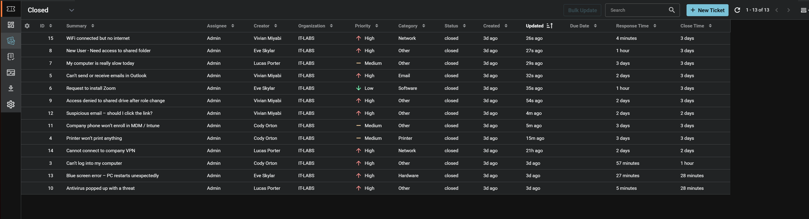
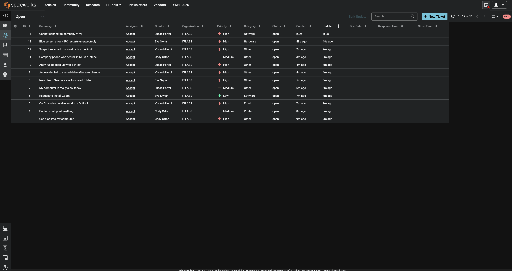
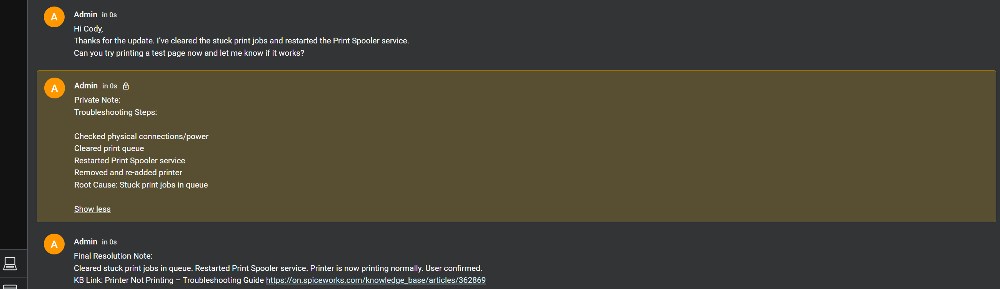
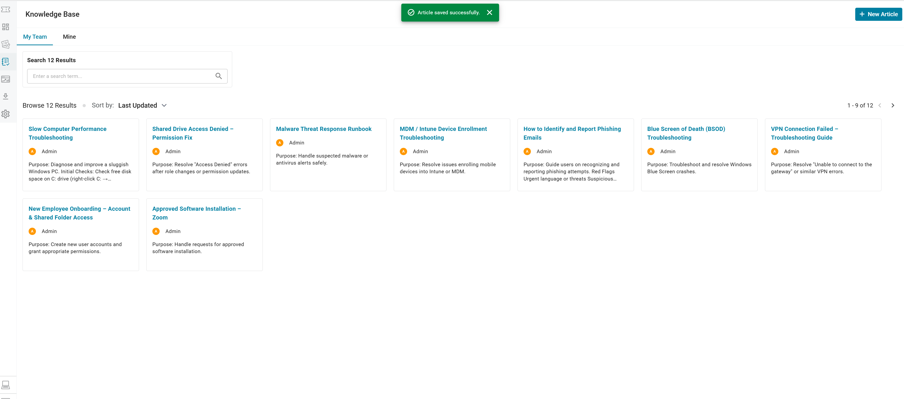
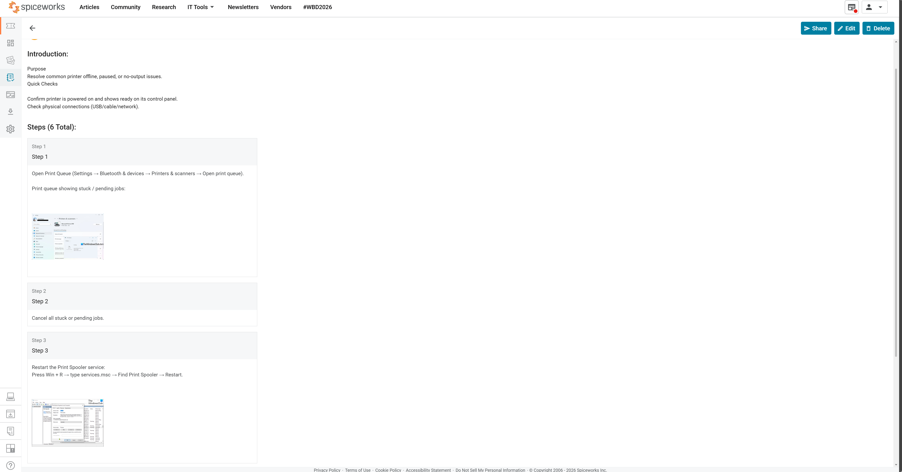
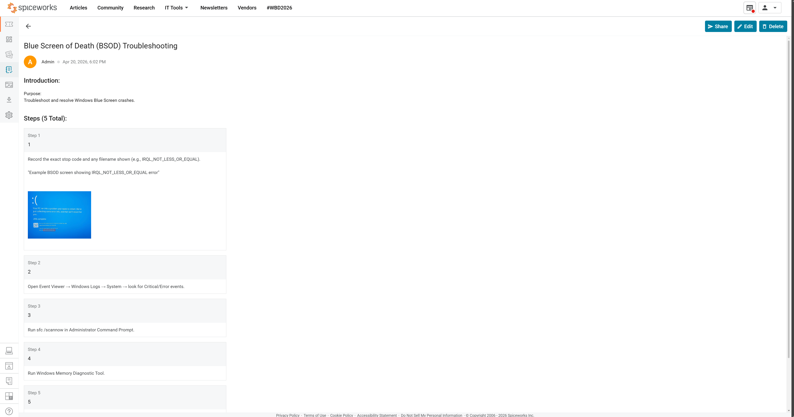
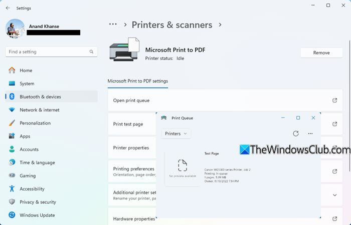
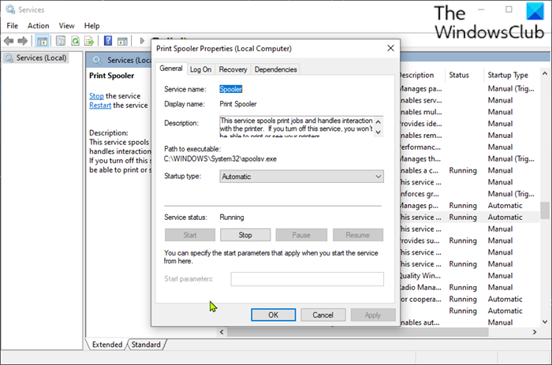
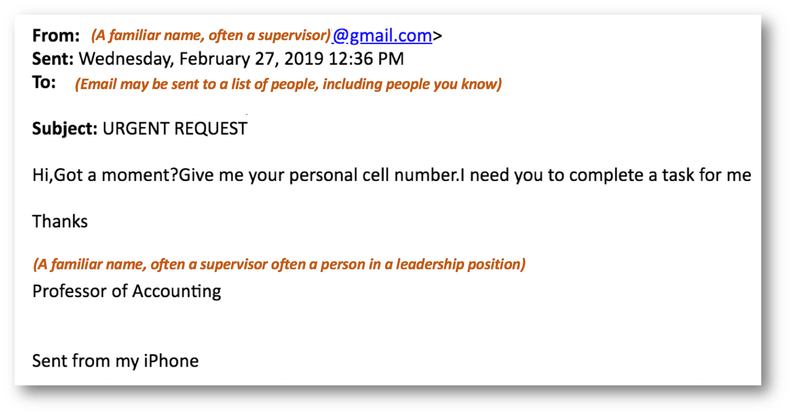
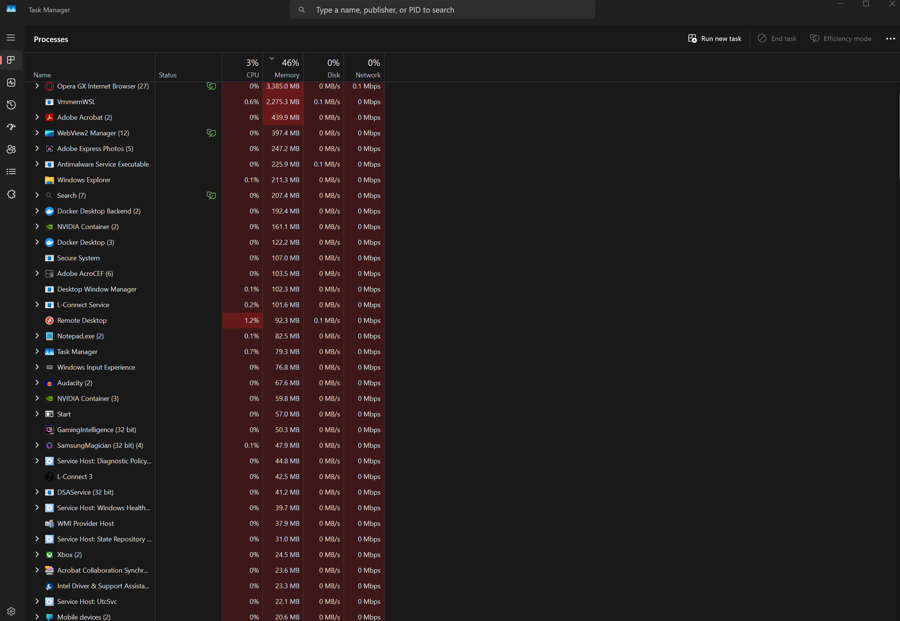

# IT Help Desk Homelab - Spiceworks Ticketing System

## Project Overview
This homelab demonstrates a complete **IT Support / Help Desk workflow** using Spiceworks Cloud Help Desk.

I simulated a realistic corporate IT environment (IT-LABS) by:
- Creating 12+ realistic employee support tickets
- Triage, prioritization, and assignment
- Performing troubleshooting and resolution steps
- Documenting everything with **Public Replies**, **Private Notes**, and **Final Resolution Notes**
- Building a **Knowledge Base (KB)** with 12 professional articles
- Closing all tickets and linking them to KB articles

**Goal**: Build practical help desk experience and create strong portfolio evidence for IT Support / Help Desk / Desktop Support roles.

## Lab Goals Achieved
- Ticket lifecycle management (Open → In Progress → Closed)
- Professional customer communication
- Internal documentation & root cause analysis
- Knowledge Base creation for self-service and team reference
- Common IT troubleshooting scenarios (hardware, software, network, security, access, performance)

## Technologies & Tools Used
- **Spiceworks Cloud Help Desk** (ticketing system)
- Windows 11 (for troubleshooting simulations)
- Active Directory concepts (password resets, group permissions, gpupdate)
- Intune / MDM enrollment
- Print Spooler management
- Task Manager, Services.msc, Event Viewer
- Knowledge Base article creation

## Screenshots Gallery

### Lab Completion Proof

*All 13 tickets successfully resolved and closed with proper documentation.*

*Initial open ticket queue showing realistic workload.*

### Ticket Handling Example

*Complete ticket showing Public Reply, detailed Private Note (troubleshooting steps + root cause), and Final Resolution Note with KB link.*

### Knowledge Base

*12 professional KB articles created and organized.*

*Detailed step-by-step KB article with embedded screenshots.*

### Troubleshooting Screenshots

*Blue Screen of Death (BSOD) KB article with example error screen.*

*Stuck print jobs in queue - common printer issue.*

*Restarting Print Spooler service during troubleshooting.*

*Realistic suspicious/phishing email used in security ticket.*

*Task Manager showing high memory/CPU - slow PC troubleshooting.*

## Key Learnings
- Clear distinction between **Public** (user-facing) and **Private** (internal) notes
- Importance of documenting root cause and resolution steps
- Building reusable Knowledge Base articles to reduce future ticket volume
- Professional communication with end-users
- Efficient ticket triage using categories and priorities
- Real-world troubleshooting for common issues (printers, email, performance, access, security, BSOD, VPN, MDM)

## Skills Demonstrated
- ITIL-aligned help desk practices
- Active Directory user & permission management
- Windows troubleshooting & diagnostics
- Security awareness (phishing, malware response)
- Documentation & knowledge management
- Customer service & clear communication

---

**Created as part of my IT Homelab portfolio**  
Ready for IT Support / Help Desk / Desktop Support positions.

Feel free to reach out if you'd like to see the full KB articles or more details!
